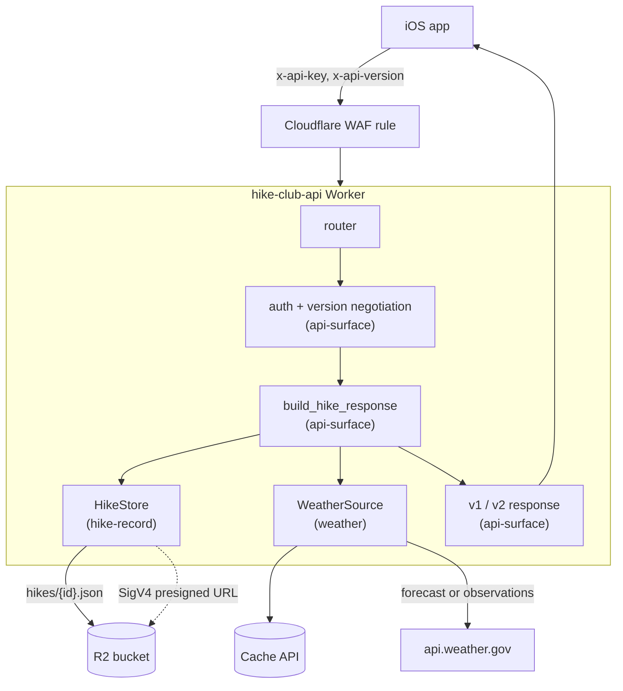

# High-Level Design: hike-club-api

## Problem

A Cub Scout pack hikes a different DuPage County forest preserve most months. Everything a family needs on hike morning — when and where to meet, which trails, what the map looks like, whether it will rain or be dangerously hot — lives scattered across emails, a PDF nobody can find, and whatever weather app each parent happens to open. The pack's iOS app can present all of it in one screen, but only if something assembles it.

This API is that something: one authenticated request returns a complete, current picture of a hike, with weather already interpreted into the alerts a hike leader actually acts on (rain in the window, heat index above 85°F, wind chill below 32°F) rather than raw forecast data the app would have to reason about itself.

## Approach

A single Rust Cloudflare Worker, deployed at the edge, with no framework beyond the `worker` crate's router.

**R2 is the source of truth.** This worker only ever reads it. Hike metadata is one JSON object per location in the bucket; the trail map is a PNG beside it. There is no admin app and no local mirror — `location_based/` holds a per-location *template* with the meeting coordinates and `mapKey` pre-filled and the dates left as `TODO`, which the organizer fills in and uploads with a shell script. A location's record is rewritten in place when that location is next scheduled, so the bucket holds one record per location rather than a growing history. Because the id carries no date, `start`/`end` in the R2 record are the only statement of when a hike happens.

**Weather is derived, not proxied.** The worker fetches from the National Weather Service, then does the interpretation: filtering periods to the hike window, computing heat index and wind chill, and raising the threshold alerts. The app receives conclusions.

**Every dependency sits behind a trait.** `HikeStore` and `WeatherSource` have a runtime implementation that talks to R2 and api.weather.gov, and a fixture implementation used by unit tests. The orchestration between them is a pure async function taking both as generics, so the entire request path except the Workers glue is testable with no network and no runtime.

**Versioning is explicit, required, and enforced.** Clients send `x-api-version`; there is no default. A shipped version keeps its response shape until its published sunset date, carrying RFC 8594 `Deprecation`/`Sunset`/`Link` headers in the meantime so an old app build tells on itself. Past that date the version is `410 Gone` and the response names the versions still being served — a date that is advertised but never acted on teaches clients to ignore it.

**Delivery is gated, not ceremonial.** Git hooks run formatting and lint at commit and the full suite plus a 90% line-coverage gate at push; CI repeats both, deploys every PR to a preview worker, and smoke-tests it. Releases are cut by semantic-release from conventional commits, which is why PR titles are linted — squash-merge makes the PR title the commit semantic-release parses.

## Target Users

- **The pack's iOS app** — the only client. Sends a shared API key and a version header, renders one hike screen. It cannot retry intelligently or interpret raw forecast data, so the API owes it complete, already-decided answers.
- **The hike organizer** — publishes hikes by running `scripts/upload-hike.sh` against R2 and maintains `resources/hike-location-mapping.json`. Tolerates a CLI; will not maintain a CMS.
- **Families on hike morning** — indirect users, on phones, in a parking lot, possibly with no signal by the time they arrive. Freshness matters less than the screen being complete when it loads.

## Goals

- One request returns everything a hike screen needs: time, meeting point with a Google Maps link, trails, a fetchable map URL, and interpreted weather.
- P90 latency under 1s, P99 under 1.5s.
- Weather alerts fire on the conditions a hike leader acts on, not on raw NWS categories.
- A completed hike still returns weather — observed, not forecast — so the screen stays useful after the fact.
- The whole system runs inside Cloudflare's and R2's free tiers.
- 90% line coverage on business logic, enforced before push and in CI.
- Shipping a new response shape never requires the installed app to update.

## Non-Goals

- **No public access.** A WAF rule filters unauthenticated traffic at the edge and the worker re-checks the key; there is no signup, no per-user identity, no rate limiting beyond what Cloudflare gives free.
- **No management UI.** Publishing a hike is a shell script against R2. A management app is more surface than one organizer scheduling one hike a month needs.
- **No hike history.** One record per location, overwritten on reschedule. Past hikes are not archived and are not queryable.
- **No write API.** Everything is `GET`. Content changes happen out-of-band through R2.
- **No database.** No D1, no KV, no Durable Objects. R2 plus the Cache API covers the access patterns.
- **No quantitative precipitation.** Probability and timing only; NWS hourly forecast does not expose amount without a second gridpoint fetch.

## Tenets

- **The free tier is a constraint, not a target.** When a feature would need paid Cloudflare or R2 capacity, the feature changes.
- **Never break a shipped client.** New behavior gets a new `x-api-version`; a shipped version keeps its shape until its published sunset date.
- **Degrade the auxiliary, never the core.** A hike's identity, time, meeting point, and map are always served; enrichments drop out of the response rather than failing it.
- **Thin runtime glue, pure testable core.** Anything that can only run inside a deployed worker stays a shim behind a trait; the logic it wraps is a pure function.

## System Design

Three arrow segments divide the worker:

| Segment | Prefix | Owns |
|---|---|---|
| `api-surface` | `API` | Routing, API-key enforcement, version negotiation and the version registry, request orchestration, the versioned wire contract and its OpenAPI conformance, error-to-status mapping, `/hike-locations`, `/health`. |
| `hike-record` | `HIKE` | The R2 object layout, hike-record retrieval, parsing and validation, SigV4 presigned map URLs and their TTL. |
| `weather` | `WX` | Choosing forecast versus observations, NWS fetching and caching, response parsing, derived heat index / wind chill / precipitation alerts, and the v1 and v2 weather blocks. |

The boundaries follow the trait seams: `api-surface` depends on `hike-record` and `weather` only through `HikeStore` and `WeatherSource`, so a segment's internals can change without touching its siblings.

## Key Design Decisions

**Rust on Workers rather than a Node or Python worker.** Wasm keeps cold starts and CPU time inside the free tier's limits, and the type system makes the v1/v2 response split a compile-time concern. The cost is a build toolchain (`worker-build`, a `reference-types` RUSTFLAG) and a runtime that cannot be exercised outside a deployed worker — which is why the coverage gate excludes the glue files rather than chasing them with integration tests.

**R2 objects instead of a database.** One organizer schedules roughly one hike a month; the access pattern is a single key lookup. D1 or KV would add a schema and a migration story to buy nothing. R2 also holds the map images, so metadata and map live together.

**Location-slug record ids with no date component.** A hike's id is its location slug, and `start`/`end` are the only source of its date. Rescheduling rewrites the record in place. An id carrying a date would mean the app must know the date to build a URL, and would accumulate dead objects. The trade is that hike history is unavailable, which the Non-Goals accept.

**Presigned R2 URLs over proxying map bytes.** Serving a 1MB PNG through the worker would burn CPU time and bandwidth on every hike view. A SigV4 query-signed URL with a 1-hour TTL lets the client fetch from R2 directly. Presigning is a pure function of `now`, so it is unit-testable without a wasm clock.

**Required version header with no default.** A missing `x-api-version` is a 400 rather than an implicit v1. Defaulting means a client that never sends the header is silently pinned to the oldest shape forever, and the sunset date becomes unenforceable.

**Weather is best-effort, structurally.** A weather failure yields `weatherAvailable: false` and a null `weather` block, never a non-200. The alternative — failing the request — would hide the meeting point and map behind an NWS outage, which is the one thing a family in a parking lot needs.

**Observations for past hikes, forecast for future ones.** The NWS hourly forecast is future-only, so a completed hike would return no weather at all. When the hike window has fully passed the worker walks to the nearest observation station instead and reshapes readings into the same period type the forecast builders already consume.

**Never cache a periodless weather result.** An empty result is an upstream gap, not authoritative "no weather"; caching one suppresses weather for the entire TTL. Empty results are returned but not written, and an empty cache entry is treated as a miss.

**A 90% coverage gate on logic only.** `lib.rs`, `r2_adapter.rs`, and `weather_adapter.rs` are excluded because they are Workers-runtime glue that cannot execute under `cargo test`. Including them would either force a miniflare harness or push the team to write assertions that prove nothing. They are covered instead by the post-deploy smoke test against the preview worker.

**Contract testing by schema conformance, not live calls.** `tests/contract.rs` serializes the response types and validates them against `openapi.yaml` in-process, which needs no network and runs at push time. It catches the failure that matters — a Rust type drifting from the published spec — without a deployed worker.

## Success Metrics

- P90 request latency ≤ 1s and P99 ≤ 1.5s, measured at the worker.
- Cloudflare Worker requests, R2 Class A/B operations, and R2 storage all stay inside the free tier month over month.
- `weatherAvailable` is true for any hike whose window is within NWS forecast range and whose meeting point is in NWS coverage.
- No installed app build stops working because of a server-side change; every shape change ships under a new version header.
- The coverage gate holds at 90% without the exclusion list growing.

**Falsification.** The project is broken if anything it presents is not accurate: a meeting point that is not where the pack gathers, a map that is not this hike's trails, a start time left over from the last time that location was scheduled, or weather that contradicts what is happening outside. To a family standing in a parking lot the screen is authoritative, so a confidently wrong answer is worse than a slow one and far worse than an absent one — which is why enrichments drop out rather than degrade.

## References

- `openapi.yaml` — the published v1/v2 response contract.
- `resources/hike-location-mapping.json` — location slug to display name, embedded at compile time and served verbatim by `GET /hike-locations`.
- `location_based/` — per-location record templates staged for upload; R2 holds the live records.
- `scripts/upload-hike.sh` — publishes a hike's metadata and map to R2.
- [NWS API](https://www.weather.gov/documentation/services-web-api) — `/points`, `/gridpoints/.../forecast/hourly`, `/stations/.../observations`, `/alerts/active`.
- [RFC 8594](https://www.rfc-editor.org/rfc/rfc8594) — the `Sunset` HTTP header.
- [Cloudflare Workers limits](https://developers.cloudflare.com/workers/platform/limits/) — free-tier request, CPU, and R2 operation budgets.
